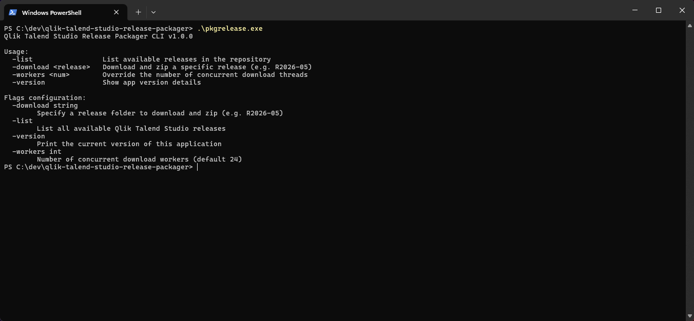
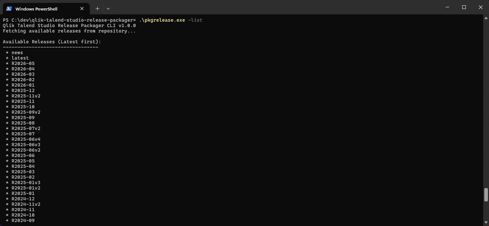
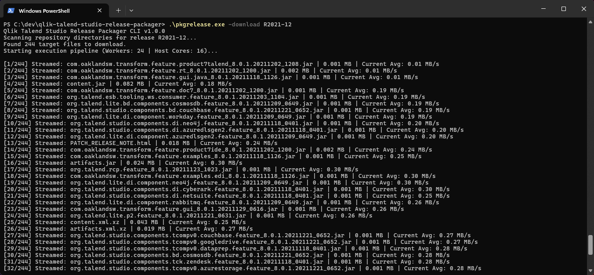
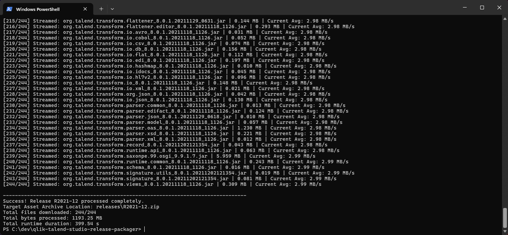
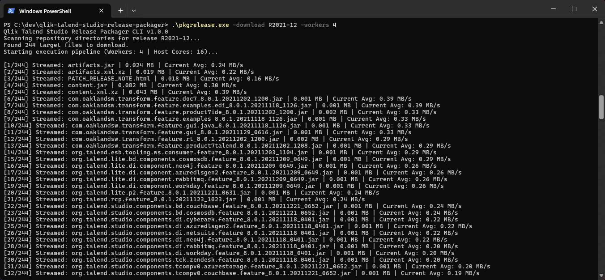
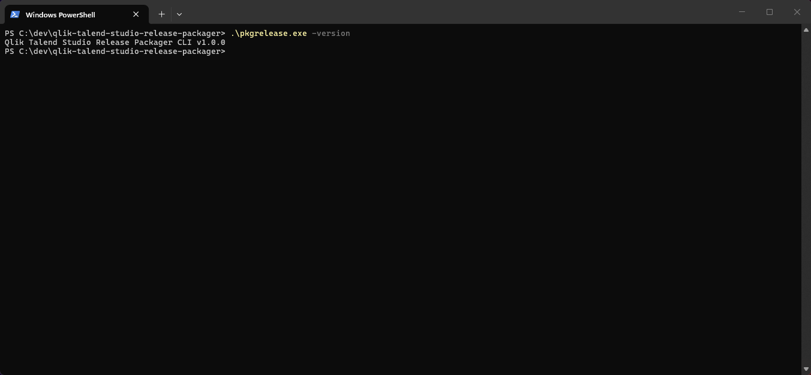

# Qlik Talend Studio Release Packager (`pkgrelease`)

[](https://github.com/gdommergue/qlik-talend-studio-release-packager/actions)

`pkgrelease` is a lightweight, zero-dependency Go CLI utility that automates the packaging of Qlik Talend Studio patches. By scraping the remote directory, it orchestrates a dynamic worker pool to concurrently stream files directly into a `.zip` archive on-the-fly, minimizing local disk I/O and RAM overhead.

## The Purpose: Air-Gapped Environments

Enterprise environments often operate under strict security mandates inside **air-gapped networks** with no internet access. Because offline Studio instances cannot fetch updates directly, manual patching is tedious and error-prone.

`pkgrelease` solves this by bundling a complete patch release into a single ZIP archive from an internet-facing machine. This package can be audited, transferred via secure media, and deployed offline to keep air-gapped installations up to date.

## Key Features

* **Air-Gap Focused:** Consolidates hundreds of remote patch files into a single clear archive ready for offline distribution.
* **On-the-Fly Streaming:** Streams network data directly into the zip structure without saving temporary files to your local drive.
* **Resilient Architecture:** Implements a 10-pass exponential backoff retry system to survive server throttling and dropped sockets.
* **Dynamic Concurrency:** Inspects the host machine CPU layout at runtime to optimize network worker allocation.
* **Multi-Platform:** Natively cross-compiled for Windows (UAC-safe, bypassing installer detection heuristics), Linux, and macOS via GitHub Actions.

## Installation

Download the native binary for your OS from the [Releases](https://www.google.com/search?q=https://github.com/gdommergue/qlik-talend-studio-release-packager/releases) page, or compile it manually:

```bash
go build -ldflags="-s -w" -o pkgrelease.exe main.go
```

## Usage

### 0. List Available CLI options

```powershell
.\pkgrelease.exe
```



### 1. List Available Studio Releases

```powershell
.\pkgrelease.exe -list
```



### 2. Download and Package a Specific Release

```powershell
.\pkgrelease.exe -download R2026-05
```





### 3. Adjust Parallel Workers (Optional)

Override the automatic CPU-scaled default to match your network bandwidth:

```powershell
.\pkgrelease.exe -download R2026-05 -workers 4
```



### 4. Check Utility Version

```powershell
.\pkgrelease.exe -version
```

